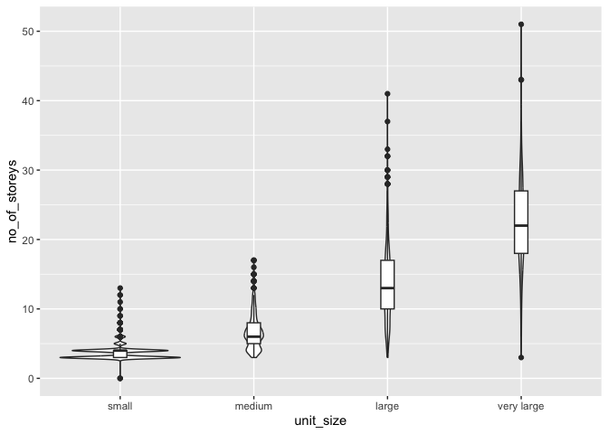
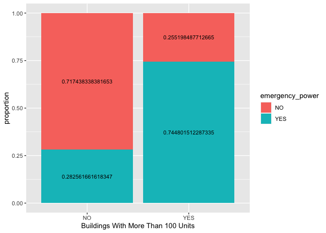
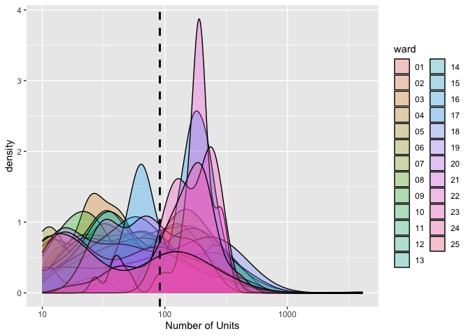
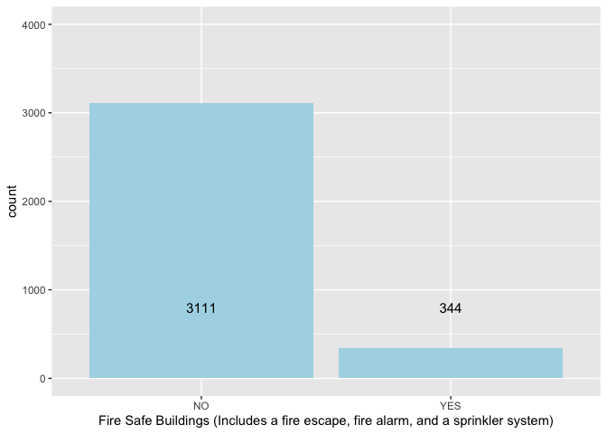

Mini Data Analysis Milestone 2
================

*To complete this milestone, you can either edit [this `.rmd`
file](https://raw.githubusercontent.com/UBC-STAT/stat545.stat.ubc.ca/master/content/mini-project/mini-project-2.Rmd)
directly. Fill in the sections that are commented out with
`<!--- start your work here--->`. When you are done, make sure to knit
to an `.md` file by changing the output in the YAML header to
`github_document`, before submitting a tagged release on canvas.*

# Welcome to the rest of your mini data analysis project!

In Milestone 1, you explored your data. and came up with research
questions. This time, we will finish up our mini data analysis and
obtain results for your data by:

- Making summary tables and graphs
- Manipulating special data types in R: factors and/or dates and times.
- Fitting a model object to your data, and extract a result.
- Reading and writing data as separate files.

We will also explore more in depth the concept of *tidy data.*

**NOTE**: The main purpose of the mini data analysis is to integrate
what you learn in class in an analysis. Although each milestone provides
a framework for you to conduct your analysis, it’s possible that you
might find the instructions too rigid for your data set. If this is the
case, you may deviate from the instructions – just make sure you’re
demonstrating a wide range of tools and techniques taught in this class.

# Instructions

**To complete this milestone**, edit [this very `.Rmd`
file](https://raw.githubusercontent.com/UBC-STAT/stat545.stat.ubc.ca/master/content/mini-project/mini-project-2.Rmd)
directly. Fill in the sections that are tagged with
`<!--- start your work here--->`.

**To submit this milestone**, make sure to knit this `.Rmd` file to an
`.md` file by changing the YAML output settings from
`output: html_document` to `output: github_document`. Commit and push
all of your work to your mini-analysis GitHub repository, and tag a
release on GitHub. Then, submit a link to your tagged release on canvas.

**Points**: This milestone is worth 50 points: 45 for your analysis, and
5 for overall reproducibility, cleanliness, and coherence of the Github
submission.

**Research Questions**: In Milestone 1, you chose two research questions
to focus on. Wherever realistic, your work in this milestone should
relate to these research questions whenever we ask for justification
behind your work. In the case that some tasks in this milestone don’t
align well with one of your research questions, feel free to discuss
your results in the context of a different research question.

# Learning Objectives

By the end of this milestone, you should:

- Understand what *tidy* data is, and how to create it using `tidyr`.
- Generate a reproducible and clear report using R Markdown.
- Manipulating special data types in R: factors and/or dates and times.
- Fitting a model object to your data, and extract a result.
- Reading and writing data as separate files.

# Setup

Begin by loading your data and the tidyverse package below:

``` r
library(datateachr) # <- might contain the data you picked!
library(tidyverse)
```

# Task 1: Process and summarize your data

From milestone 1, you should have an idea of the basic structure of your
dataset (e.g. number of rows and columns, class types, etc.). Here, we
will start investigating your data more in-depth using various data
manipulation functions.

### 1.1 (1 point)

First, write out the 4 research questions you defined in milestone 1
were. This will guide your work through milestone 2:

<!-------------------------- Start your work below ---------------------------->

1.  Do the number of storeys in apartment buildings correlate with the
    number of units?
2.  Is it more likely for buildings to have emergency power if there are
    more than 100 units?
3.  Are the units in each ward equally distributed?
4.  How many buildings are fully equipped with an exterior fire escape,
    fire alarms, and a sprinkler system?
    <!----------------------------------------------------------------------------->

Here, we will investigate your data using various data manipulation and
graphing functions.

### 1.2 (8 points)

Now, for each of your four research questions, choose one task from
options 1-4 (summarizing), and one other task from 4-8 (graphing). You
should have 2 tasks done for each research question (8 total). Make sure
it makes sense to do them! (e.g. don’t use a numerical variables for a
task that needs a categorical variable.). Comment on why each task helps
(or doesn’t!) answer the corresponding research question.

Ensure that the output of each operation is printed!

Also make sure that you’re using dplyr and ggplot2 rather than base R.
Outside of this project, you may find that you prefer using base R
functions for certain tasks, and that’s just fine! But part of this
project is for you to practice the tools we learned in class, which is
dplyr and ggplot2.

**Summarizing:**

1.  Compute the *range*, *mean*, and *two other summary statistics* of
    **one numerical variable** across the groups of **one categorical
    variable** from your data.
2.  Compute the number of observations for at least one of your
    categorical variables. Do not use the function `table()`!
3.  Create a categorical variable with 3 or more groups from an existing
    numerical variable. You can use this new variable in the other
    tasks! *An example: age in years into “child, teen, adult, senior”.*
4.  Compute the proportion and counts in each category of one
    categorical variable across the groups of another categorical
    variable from your data. Do not use the function `table()`!

**Graphing:**

6.  Create a graph of your choosing, make one of the axes logarithmic,
    and format the axes labels so that they are “pretty” or easier to
    read.
7.  Make a graph where it makes sense to customize the alpha
    transparency.

Using variables and/or tables you made in one of the “Summarizing”
tasks:

8.  Create a graph that has at least two geom layers.
9.  Create 3 histograms, with each histogram having different sized
    bins. Pick the “best” one and explain why it is the best.

Make sure it’s clear what research question you are doing each operation
for!

<!------------------------- Start your work below ----------------------------->

## 1. Do the number of storeys in apartment buildings correlate with the number of units?

``` r
data <- apt_buildings # for data visualization
# Summarizing Option 3: Create a categorical variable with 3 or more groups from an existing numerical variable. 
# Create categorical variables for unit building size based on the number of units in each building ranging from small (less than or equal to 50 units), medium (between 50 to 100 units inclusive), large (between 100 to 300 units inclusive), to very large (greater than or equal to 300 units). 
unit_category <- apt_buildings %>% 
   mutate(unit_size = factor(case_when(no_of_units <= 50 ~ "small",
                                 no_of_units <= 100 ~ "medium",
                                 no_of_units <= 300 ~ "large",
                                 TRUE ~ "very large"),
          levels = c('small', 'medium', 'large', 'very large')))
print(unit_category)
```

    ## # A tibble: 3,455 × 38
    ##       id air_conditioning amenities             balconies barrier_free_accessi…¹
    ##    <dbl> <chr>            <chr>                 <chr>     <chr>                 
    ##  1 10359 NONE             Outdoor rec faciliti… YES       YES                   
    ##  2 10360 NONE             Outdoor pool          YES       NO                    
    ##  3 10361 NONE             <NA>                  YES       NO                    
    ##  4 10362 NONE             <NA>                  YES       YES                   
    ##  5 10363 NONE             <NA>                  NO        NO                    
    ##  6 10364 NONE             <NA>                  NO        NO                    
    ##  7 10365 NONE             <NA>                  NO        YES                   
    ##  8 10366 CENTRAL AIR      Indoor pool , Indoor… YES       NO                    
    ##  9 10367 NONE             <NA>                  YES       YES                   
    ## 10 10368 NONE             Indoor recreation ro… YES       YES                   
    ## # ℹ 3,445 more rows
    ## # ℹ abbreviated name: ¹​barrier_free_accessibilty_entr
    ## # ℹ 33 more variables: bike_parking <chr>, exterior_fire_escape <chr>,
    ## #   fire_alarm <chr>, garbage_chutes <chr>, heating_type <chr>, intercom <chr>,
    ## #   laundry_room <chr>, locker_or_storage_room <chr>, no_of_elevators <dbl>,
    ## #   parking_type <chr>, pets_allowed <chr>, prop_management_company_name <chr>,
    ## #   property_type <chr>, rsn <dbl>, separate_gas_meters <chr>, …

``` r
# This task helps better organize buildings by their size to get a broad overview of the distribution of building unit sizes. However, using this new data frame may be overgeneralizing when comparing it to the number of storeys since we are looking at the variables separately instead of looking at the association between the number of units and storeys for each building. What might be better is to compute the correlation between the number of units and number of storeys directly. For this task, I wanted to practice creating new categorical variables from the original data set

# Graphing Option 8
# Create a boxplot between the categorical variables for different unit sizes against the number of stories.
size_storey <- unit_category %>% 
  ggplot(aes(x = unit_size, y = no_of_storeys)) +
  geom_violin() +
  geom_boxplot(width = 0.1)
  
print(size_storey)
```

<!-- -->

``` r
# This task of creating a boxplot helps visualize the distribution of the number of storeys based on the size of building units. From the graph, we can see a trend that buildings with increasing unit sizes have increased number of storeys as well. However, the violin plot might not be as helpful since the number of storeys is a discrete variable which caused the spikes seen in the small unit size group. 
```

## 2. Is it more likely for buildings to have emergency power if there are more than 100 units?

``` r
# Summarizing option 4
# Create a tibble that details the number of buildings with more than 100 units and buildings that have less than 100 units. Then group them by if they have emergency power or not and calculate the proportion of buildings with more than 100 units that have emergency power as well as the proportion of buildings with less than 100 units that have emergency power. 

new_aptbuilding <- apt_buildings %>%
  mutate(more_than100 = case_when(no_of_units > 100 ~ "YES", .default = "NO")) %>%
  group_by(more_than100, emergency_power) %>%
  summarize(count = n()) %>%
  drop_na() %>%
  group_by(more_than100) %>%
  mutate(sum = sum(count)) %>%
  mutate(proportion = count/sum)
```

    ## `summarise()` has grouped output by 'more_than100'. You can override using the
    ## `.groups` argument.

``` r
print(new_aptbuilding)
```

    ## # A tibble: 4 × 5
    ## # Groups:   more_than100 [2]
    ##   more_than100 emergency_power count   sum proportion
    ##   <chr>        <chr>           <int> <int>      <dbl>
    ## 1 NO           NO               1658  2311      0.717
    ## 2 NO           YES               653  2311      0.283
    ## 3 YES          NO                270  1058      0.255
    ## 4 YES          YES               788  1058      0.745

``` r
# This task helped summarize two types of observations (buildings with more or less than 100 units) and (whether or not building has emergency power or not). It also helped determine the proportion for each group. We see that a higher proportion of buildings with more than 100 units have emergency power compared to buildings with less than 100 units with emergency power. This makes sense because more people living in one building would lead to more chaos if they had a power outage. 

# Graphing option 8: Create a graph that has at least two geom layers. 
# Create a bar graph that shows the proportion of buildings with more than 100 units or less than 100 units, and whether or not those buildings have emergency power. 

emerg_100 <- new_aptbuilding %>% 
  ggplot(aes(x = more_than100, y = proportion, fill = emergency_power)) +
  geom_col() +
  geom_text(aes(label = proportion), size = 3, position = position_stack(vjust = 0.5)) +
  xlab("Buildings With More Than 100 Units")
print(emerg_100)
```

<!-- -->

``` r
# This task was very helpful in visualizing the proportion of buildings equipped with and without emergency power based on the building having more than 100 units or less than 100 units. The labels and stacked colored bar graph also makes the interpretation very simple. 
```

## 3. Are the units in each ward equally distributed?

``` r
# Summarizing option 1: Compute the *range*, *mean*, and *two other summary statistics* of **one numerical variable** across the groups of **one categorical variable** from your data.
# Compute the range, mean, median, and standard deviation of number of units 
ward_stat <- apt_buildings %>%
  group_by(ward) %>%
  summarise(mean = mean(no_of_units),
            range = max(no_of_units) - min(no_of_units),
            median = median(no_of_units),
            sd = sd(no_of_units, na.rm = TRUE)
            )
print(ward_stat)
```

    ## # A tibble: 26 × 5
    ##    ward   mean range median    sd
    ##    <chr> <dbl> <dbl>  <dbl> <dbl>
    ##  1 01    118.    403     95  89.8
    ##  2 02     91.8   355     77  77.0
    ##  3 03     55.8   530     33  71.3
    ##  4 04     82.7   628     47  97.3
    ##  5 05     77.2   410     39  90.6
    ##  6 06     66.2   379     40  70.3
    ##  7 07    143     466    126 108. 
    ##  8 08     60.2   448     32  70.4
    ##  9 09     66.9   346     28  84.2
    ## 10 10    133.    525    119 117. 
    ## # ℹ 16 more rows

``` r
# This task calculates the summary statistics for the mean, range, median, and standard deviation for the number of units in each building grouped by their respective wards. It's helpful to see the mean and standard deviation especially since the question is asking about the distribution across wards. We can see that the mean across wards are within similar ranges. 


# Graphing option 7: Make a graph where it makes sense to customize the alpha transparency
# Make a density plot for the number of units across 25 wards under a log scale

dist_ward <- apt_buildings %>%
  filter(!is.na(no_of_units)) %>% 
  filter(!ward=="YY") %>% 
  ggplot(aes(no_of_units,  
             group = ward, fill = ward)) + 
  scale_x_log10("Number of Units") +
  geom_density(alpha = 0.3) +
  geom_vline(aes(xintercept=mean(no_of_units)), # add mean line
            color="black", linetype="dashed", size=1)
```

    ## Warning: Using `size` aesthetic for lines was deprecated in ggplot2 3.4.0.
    ## ℹ Please use `linewidth` instead.
    ## This warning is displayed once every 8 hours.
    ## Call `lifecycle::last_lifecycle_warnings()` to see where this warning was
    ## generated.

``` r
print(dist_ward)
```

    ## Warning: Transformation introduced infinite values in continuous x-axis

    ## Warning: Removed 2 rows containing non-finite values (`stat_density()`).

<!-- -->

``` r
# The task helped visualize the distribution of units across 25 wards. I did not use facetwrap because having the distribution overlay together helps make the comparison across all wards easier. I also adjusted the alpha transparency to be able to see the overlap for all the wards. I added a second geom layer for the mean line but it didn't add much value to the analysis. Most ward units fall outside of the mean. From this graph overall, we can see that there are two major overlaps around ~50 units and ~3-400 units.
```

## 4. How many buildings are fully equipped with an exterior fire escape, fire alarms, and a sprinkler system?

``` r
# Summarizing option 2: count observations
# Create a new column that returns yes or no if buildings have all 3 components of being a fire safe building. To be fire safe, buildings must have an exterior fire escape, a fire alarm, and a sprinker system.
fire_safedf <- apt_buildings %>%
  mutate(fire_safe = case_when(exterior_fire_escape == "YES" &
                                   fire_alarm == "YES" &
                                   sprinkler_system == "YES" ~ "YES",
                                  .default = "NO")) %>%
  group_by(fire_safe) %>%
  summarize(count = n()) %>%
  drop_na() 
print(fire_safedf)
```

    ## # A tibble: 2 × 2
    ##   fire_safe count
    ##   <chr>     <int>
    ## 1 NO         3111
    ## 2 YES         344

``` r
# This task was helpful in counting how many buildings have all 3 components that make a building fire safe as well as buildings that don't have all 3 or have any missing components, which directly answers the question. 

# Graphing option 8
# Create a bar graph that shows the total number of buildings that are fire safe and ones that are not fire safe. If a building does not have all 3 components, it is not considered fire safe.

fire_safe_g <- fire_safedf %>% 
  ggplot(aes(x = fire_safe, y = count)) +
  geom_bar(stat = "identity", fill="lightblue") +
  geom_text(aes(label = count, y = 4000), size = 4, position = position_stack(vjust = 0.2)) +
  xlab("Fire Safe Buildings (Includes a fire escape, fire alarm, and a sprinkler system)")

print(fire_safe_g)
```

<!-- -->

``` r
# This task was helpful in visualizing the amount of buildings that are fire safe and ones that are not, including the exact count for both groups. 
```

<!----------------------------------------------------------------------------->

### 1.3 (2 points)

Based on the operations that you’ve completed, how much closer are you
to answering your research questions? Think about what aspects of your
research questions remain unclear. Can your research questions be
refined, now that you’ve investigated your data a bit more? Which
research questions are yielding interesting results?

<!------------------------- Write your answer here ---------------------------->

With all the summarizing and graphing tasks combined, I was able to get
a better idea and visual for the answers to my research questions. I
think questions 2, 3, and 4 were made much clearer with the graphs
especially. Question 1 remains a bit unclear given the results from the
summarizing and graphing task. Instead of grouping buildings into
categories based on their size then comparing the number of storeys, it
would be more efficient to plot individual data points for each building
unit and its associated storey height.

<!----------------------------------------------------------------------------->

# Task 2: Tidy your data

In this task, we will do several exercises to reshape our data. The goal
here is to understand how to do this reshaping with the `tidyr` package.

A reminder of the definition of *tidy* data:

- Each row is an **observation**
- Each column is a **variable**
- Each cell is a **value**

### 2.1 (2 points)

Based on the definition above, can you identify if your data is tidy or
untidy? Go through all your columns, or if you have \>8 variables, just
pick 8, and explain whether the data is untidy or tidy.

<!--------------------------- Start your work below --------------------------->

``` r
glimpse(apt_buildings) # glimpse of entire data set
```

    ## Rows: 3,455
    ## Columns: 37
    ## $ id                               <dbl> 10359, 10360, 10361, 10362, 10363, 10…
    ## $ air_conditioning                 <chr> "NONE", "NONE", "NONE", "NONE", "NONE…
    ## $ amenities                        <chr> "Outdoor rec facilities", "Outdoor po…
    ## $ balconies                        <chr> "YES", "YES", "YES", "YES", "NO", "NO…
    ## $ barrier_free_accessibilty_entr   <chr> "YES", "NO", "NO", "YES", "NO", "NO",…
    ## $ bike_parking                     <chr> "0 indoor parking spots and 10 outdoo…
    ## $ exterior_fire_escape             <chr> "NO", "NO", "NO", "YES", "NO", NA, "N…
    ## $ fire_alarm                       <chr> "YES", "YES", "YES", "YES", "YES", "Y…
    ## $ garbage_chutes                   <chr> "YES", "YES", "NO", "NO", "NO", "NO",…
    ## $ heating_type                     <chr> "HOT WATER", "HOT WATER", "HOT WATER"…
    ## $ intercom                         <chr> "YES", "YES", "YES", "YES", "YES", "Y…
    ## $ laundry_room                     <chr> "YES", "YES", "YES", "YES", "YES", "Y…
    ## $ locker_or_storage_room           <chr> "NO", "YES", "YES", "YES", "NO", "YES…
    ## $ no_of_elevators                  <dbl> 3, 3, 0, 1, 0, 0, 0, 2, 4, 2, 0, 2, 2…
    ## $ parking_type                     <chr> "Underground Garage , Garage accessib…
    ## $ pets_allowed                     <chr> "YES", "YES", "YES", "YES", "YES", "Y…
    ## $ prop_management_company_name     <chr> NA, "SCHICKEDANZ BROS. PROPERTIES", N…
    ## $ property_type                    <chr> "PRIVATE", "PRIVATE", "PRIVATE", "PRI…
    ## $ rsn                              <dbl> 4154812, 4154815, 4155295, 4155309, 4…
    ## $ separate_gas_meters              <chr> "NO", "NO", "NO", "NO", "NO", "NO", "…
    ## $ separate_hydro_meters            <chr> "YES", "YES", "YES", "YES", "YES", "Y…
    ## $ separate_water_meters            <chr> "NO", "NO", "NO", "NO", "NO", "NO", "…
    ## $ site_address                     <chr> "65  FOREST MANOR RD", "70  CLIPPER R…
    ## $ sprinkler_system                 <chr> "YES", "YES", "NO", "YES", "NO", "NO"…
    ## $ visitor_parking                  <chr> "PAID", "FREE", "UNAVAILABLE", "UNAVA…
    ## $ ward                             <chr> "17", "17", "03", "03", "02", "02", "…
    ## $ window_type                      <chr> "DOUBLE PANE", "DOUBLE PANE", "DOUBLE…
    ## $ year_built                       <dbl> 1967, 1970, 1927, 1959, 1943, 1952, 1…
    ## $ year_registered                  <dbl> 2017, 2017, 2017, 2017, 2017, NA, 201…
    ## $ no_of_storeys                    <dbl> 17, 14, 4, 5, 4, 4, 4, 7, 32, 4, 4, 7…
    ## $ emergency_power                  <chr> "NO", "YES", "NO", "NO", "NO", "NO", …
    ## $ `non-smoking_building`           <chr> "YES", "NO", "YES", "YES", "YES", "NO…
    ## $ no_of_units                      <dbl> 218, 206, 34, 42, 25, 34, 14, 105, 57…
    ## $ no_of_accessible_parking_spaces  <dbl> 8, 10, 20, 42, 12, 0, 5, 1, 1, 6, 12,…
    ## $ facilities_available             <chr> "Recycling bins", "Green Bin / Organi…
    ## $ cooling_room                     <chr> "NO", "NO", "NO", "NO", "NO", "NO", "…
    ## $ no_barrier_free_accessible_units <dbl> 2, 0, 0, 42, 0, NA, 14, 0, 0, 1, 25, …

``` r
subset_apt <- apt_buildings %>% select(id, no_of_storeys, no_of_units, emergency_power, exterior_fire_escape, sprinkler_system, fire_alarm, balconies) # select 8 variables creating a subset of data from apt_buildings
glimpse(subset_apt) # check subset of variables 
```

    ## Rows: 3,455
    ## Columns: 8
    ## $ id                   <dbl> 10359, 10360, 10361, 10362, 10363, 10364, 10365, …
    ## $ no_of_storeys        <dbl> 17, 14, 4, 5, 4, 4, 4, 7, 32, 4, 4, 7, 5, 6, 7, 3…
    ## $ no_of_units          <dbl> 218, 206, 34, 42, 25, 34, 14, 105, 571, 171, 26, …
    ## $ emergency_power      <chr> "NO", "YES", "NO", "NO", "NO", "NO", "NO", "YES",…
    ## $ exterior_fire_escape <chr> "NO", "NO", "NO", "YES", "NO", NA, "NO", "NO", "N…
    ## $ sprinkler_system     <chr> "YES", "YES", "NO", "YES", "NO", "NO", "NO", "YES…
    ## $ fire_alarm           <chr> "YES", "YES", "YES", "YES", "YES", "YES", "YES", …
    ## $ balconies            <chr> "YES", "YES", "YES", "YES", "NO", "NO", "NO", "YE…

``` r
length_check = length(subset_apt$id) == length(unique(subset_apt$id)) 
print(length_check) # shows that each row corresponds to a unique observation based on the ID number
```

    ## [1] TRUE

Based on my 4 reserach questions, the dataset is tidy. The variables I
used were no_of_storeys, no_of_units, emergency_power,
exterior_fire_escape, sprinker_system, fire_alarm. To reach 8 variables
as the question suggests, I included id and balconies. The data remains
tidy with all 8 variables.From the subset of data, each row is an
observation, each column is a distinct variable, and each cell contains
a unique value. Therefore, the apt_building data I have selected is
tidy. It may have some NA values but that does not mean the data is
untidy.

<!----------------------------------------------------------------------------->

### 2.2 (4 points)

Now, if your data is tidy, untidy it! Then, tidy it back to it’s
original state.

If your data is untidy, then tidy it! Then, untidy it back to it’s
original state.

Be sure to explain your reasoning for this task. Show us the “before”
and “after”.

<!--------------------------- Start your work below --------------------------->

Since my data is tidy, I will untidy it using the pivot function.

#### Before: Each column is a variable and each row is an observation

``` r
head(subset_apt)
```

    ## # A tibble: 6 × 8
    ##      id no_of_storeys no_of_units emergency_power exterior_fire_escape
    ##   <dbl>         <dbl>       <dbl> <chr>           <chr>               
    ## 1 10359            17         218 NO              NO                  
    ## 2 10360            14         206 YES             NO                  
    ## 3 10361             4          34 NO              NO                  
    ## 4 10362             5          42 NO              YES                 
    ## 5 10363             4          25 NO              NO                  
    ## 6 10364             4          34 NO              <NA>                
    ## # ℹ 3 more variables: sprinkler_system <chr>, fire_alarm <chr>, balconies <chr>

#### Unitdy the data

``` r
widen_apt <- subset_apt %>% 
  pivot_wider(
              names_from = emergency_power, 
              values_from = no_of_storeys)
head(widen_apt)
```

    ## # A tibble: 6 × 9
    ##      id no_of_units exterior_fire_escape sprinkler_system fire_alarm balconies
    ##   <dbl>       <dbl> <chr>                <chr>            <chr>      <chr>    
    ## 1 10359         218 NO                   YES              YES        YES      
    ## 2 10360         206 NO                   YES              YES        YES      
    ## 3 10361          34 NO                   NO               YES        YES      
    ## 4 10362          42 YES                  YES              YES        YES      
    ## 5 10363          25 NO                   NO               YES        NO       
    ## 6 10364          34 <NA>                 NO               YES        NO       
    ## # ℹ 3 more variables: NO <dbl>, YES <dbl>, `NA` <dbl>

``` r
# By using pivot wider, now the values for the number of storeys for each building are listed under the values for emergency_power (NO, YES, NA)
# The last 3 columns are no longer unique variables, making this dataset untidy.
```

After: Re-tidy the data

``` r
tidy_apt <- widen_apt %>%
  pivot_longer(
    cols = c("YES", "NO", "NA"),
    names_to = "emergency_power",
    values_to = "no_of_storeys") %>%
  select(c(no_of_storeys, emergency_power), !c(no_of_storeys, emergency_power))%>%
  filter(!is.na(emergency_power), !is.na(no_of_storeys)) # remove NA's
glimpse(tidy_apt) 
```

    ## Rows: 3,455
    ## Columns: 8
    ## $ no_of_storeys        <dbl> 17, 14, 4, 5, 4, 4, 4, 7, 32, 4, 4, 7, 5, 6, 7, 3…
    ## $ emergency_power      <chr> "NO", "YES", "NO", "NO", "NO", "NO", "NO", "YES",…
    ## $ id                   <dbl> 10359, 10360, 10361, 10362, 10363, 10364, 10365, …
    ## $ no_of_units          <dbl> 218, 206, 34, 42, 25, 34, 14, 105, 571, 171, 26, …
    ## $ exterior_fire_escape <chr> "NO", "NO", "NO", "YES", "NO", NA, "NO", "NO", "N…
    ## $ sprinkler_system     <chr> "YES", "YES", "NO", "YES", "NO", "NO", "NO", "YES…
    ## $ fire_alarm           <chr> "YES", "YES", "YES", "YES", "YES", "YES", "YES", …
    ## $ balconies            <chr> "YES", "YES", "YES", "YES", "NO", "NO", "NO", "YE…

The data is now tidy because I have converted back the columns such that
each column is a unique variable, each row is an observation, and each
cell is a value.

<!----------------------------------------------------------------------------->

### 2.3 (4 points)

Now, you should be more familiar with your data, and also have made
progress in answering your research questions. Based on your interest,
and your analyses, pick 2 of the 4 research questions to continue your
analysis in the remaining tasks:

<!-------------------------- Start your work below ---------------------------->

1.  Do the number of storeys in apartment buildings correlate with the
    number of units?
2.  How many buildings are fully equipped with an exterior fire escape,
    fire alarms, and a sprinkler system?

<!----------------------------------------------------------------------------->

Explain your decision for choosing the above two research questions.

<!--------------------------- Start your work below --------------------------->

1.  Through the summarizing and graphing tasks in part 1, I saw that
    there is a slight increase when comparing grouped unit sizes to the
    number of storeys. However, I would like to see the relationship
    directly instead of through grouping using statistical values such
    as calculating for the correlation.

2.  From the summarizing and graphing tasks, it seems like not a lot of
    buildings have all 3 fire safe components. It would be interesting
    to see how many buildings have at least one fire safe component,
    instead of having all 3.

<!----------------------------------------------------------------------------->

Now, try to choose a version of your data that you think will be
appropriate to answer these 2 questions. Use between 4 and 8 functions
that we’ve covered so far (i.e. by filtering, cleaning, tidy’ing,
dropping irrelevant columns, etc.).

(If it makes more sense, then you can make/pick two versions of your
data, one for each research question.)

<!--------------------------- Start your work below --------------------------->

filter out columns needed

``` r
dataset_final <- apt_buildings %>%
  select(no_of_storeys, no_of_units, emergency_power, exterior_fire_escape, sprinkler_system, fire_alarm) %>%
  filter(!is.na(no_of_storeys), 
         !is.na(no_of_units), 
         !is.na(emergency_power), 
         !is.na(exterior_fire_escape), 
         !is.na(sprinkler_system), 
         !is.na(fire_alarm)) %>% 
  mutate(fire_safe_one = case_when(exterior_fire_escape == "YES" ~ "YES", 
                                   fire_alarm == "YES" ~ "YES",
                                   sprinkler_system == "YES" ~ "YES",
                                  .default = "NO")) %>% # create a new column if building has at least one fire safe component 
  mutate(fire_safe_count = case_when(exterior_fire_escape == "YES" & fire_alarm == "YES" & sprinkler_system == "YES" ~ "3",
                                     exterior_fire_escape == "YES" & fire_alarm == "YES" & sprinkler_system == "NO" ~ "2",
                                     exterior_fire_escape == "YES" & fire_alarm == "NO" & sprinkler_system == "NO" ~ "1", 
                                     exterior_fire_escape == "NO" & fire_alarm == "NO" & sprinkler_system == "NO" ~ "0", 
                                     exterior_fire_escape == "NO" & fire_alarm == "YES" & sprinkler_system == "NO" ~ "1", 
                                     exterior_fire_escape == "NO" & fire_alarm == "YES" & sprinkler_system == "YES" ~ "2",
                                     exterior_fire_escape == "YES" & fire_alarm == "NO" & sprinkler_system == "YES" ~ "2",
                                     exterior_fire_escape == "NO" & fire_alarm == "NO" & sprinkler_system == "YES" ~ "1",
                                     exterior_fire_escape == "NO" & fire_alarm == "YES" & sprinkler_system == "NO" ~ "1")) # create a column that counts how many fire safe components each building has from 1 to 3
```

<!----------------------------------------------------------------------------->

# Task 3: Modelling

## 3.0 (no points)

Pick a research question from 1.2, and pick a variable of interest
(we’ll call it “Y”) that’s relevant to the research question. Indicate
these.

<!-------------------------- Start your work below ---------------------------->

**Research Question**: Do the number of units in each building correlate
with the number of storeys in each building?

**Variable of interest**: Number of units

<!----------------------------------------------------------------------------->

## 3.1 (3 points)

Fit a model or run a hypothesis test that provides insight on this
variable with respect to the research question. Store the model object
as a variable, and print its output to screen. We’ll omit having to
justify your choice, because we don’t expect you to know about model
specifics in STAT 545.

- **Note**: It’s OK if you don’t know how these models/tests work. Here
  are some examples of things you can do here, but the sky’s the limit.

  - You could fit a model that makes predictions on Y using another
    variable, by using the `lm()` function.
  - You could test whether the mean of Y equals 0 using `t.test()`, or
    maybe the mean across two groups are different using `t.test()`, or
    maybe the mean across multiple groups are different using `anova()`
    (you may have to pivot your data for the latter two).
  - You could use `lm()` to test for significance of regression
    coefficients.

<!-------------------------- Start your work below ---------------------------->

test for correlation between number of units and number of storeys using
regression analysis to obtain p value and r-squared value

``` r
model <- lm(no_of_units ~ no_of_storeys, data=apt_buildings)
summary(model)
```

    ## 
    ## Call:
    ## lm(formula = no_of_units ~ no_of_storeys, data = apt_buildings)
    ## 
    ## Residuals:
    ##    Min     1Q Median     3Q    Max 
    ## -273.6  -16.7   -7.7   11.7 3812.7 
    ## 
    ## Coefficients:
    ##               Estimate Std. Error t value Pr(>|t|)    
    ## (Intercept)   -13.9966     2.1897  -6.392 1.85e-10 ***
    ## no_of_storeys  13.5801     0.2203  61.657  < 2e-16 ***
    ## ---
    ## Signif. codes:  0 '***' 0.001 '**' 0.01 '*' 0.05 '.' 0.1 ' ' 1
    ## 
    ## Residual standard error: 80.8 on 3453 degrees of freedom
    ## Multiple R-squared:  0.524,  Adjusted R-squared:  0.5239 
    ## F-statistic:  3802 on 1 and 3453 DF,  p-value: < 2.2e-16

<!----------------------------------------------------------------------------->

## 3.2 (3 points)

Produce something relevant from your fitted model: either predictions on
Y, or a single value like a regression coefficient or a p-value.

- Be sure to indicate in writing what you chose to produce.
- Your code should either output a tibble (in which case you should
  indicate the column that contains the thing you’re looking for), or
  the thing you’re looking for itself.
- Obtain your results using the `broom` package if possible. If your
  model is not compatible with the broom function you’re needing, then
  you can obtain your results by some other means, but first indicate
  which broom function is not compatible.

<!-------------------------- Start your work below ---------------------------->

I chose to produce the regression coefficient (r squared value) to know
how much of the variation of the number of storeys can be explained by
the number of units in the regression model.

``` r
broom::glance(model) 
```

    ## # A tibble: 1 × 12
    ##   r.squared adj.r.squared sigma statistic p.value    df  logLik    AIC    BIC
    ##       <dbl>         <dbl> <dbl>     <dbl>   <dbl> <dbl>   <dbl>  <dbl>  <dbl>
    ## 1     0.524         0.524  80.8     3802.       0     1 -20076. 40158. 40176.
    ## # ℹ 3 more variables: deviance <dbl>, df.residual <int>, nobs <int>

``` r
pull(broom::glance(model), "r.squared") # prints r squared value
```

    ## [1] 0.5240289

<!----------------------------------------------------------------------------->

# Task 4: Reading and writing data

Get set up for this exercise by making a folder called `output` in the
top level of your project folder / repository. You’ll be saving things
there.

## 4.1 (3 points)

Take a summary table that you made from Task 1, and write it as a csv
file in your `output` folder. Use the `here::here()` function.

- **Robustness criteria**: You should be able to move your Mini Project
  repository / project folder to some other location on your computer,
  or move this very Rmd file to another location within your project
  repository / folder, and your code should still work.
- **Reproducibility criteria**: You should be able to delete the csv
  file, and remake it simply by knitting this Rmd file.

<!-------------------------- Start your work below ---------------------------->

``` r
#install.packages("here") 
library(here)
```

    ## here() starts at /Users/Christinechen/Desktop/STAT545/Group19/mini-project/mda-christine

``` r
write_csv(new_aptbuilding, here("output/new_aptbuilding.csv"))
```

<!----------------------------------------------------------------------------->

## 4.2 (3 points)

Write your model object from Task 3 to an R binary file (an RDS), and
load it again. Be sure to save the binary file in your `output` folder.
Use the functions `saveRDS()` and `readRDS()`.

- The same robustness and reproducibility criteria as in 4.1 apply here.

<!-------------------------- Start your work below ---------------------------->

``` r
saveRDS(model, file = here("output/model.RDS")) # save model into an RDS file into the output folder
model_RDS <- readRDS(here("output/model.RDS")) 
model_RDS
```

    ## 
    ## Call:
    ## lm(formula = no_of_units ~ no_of_storeys, data = apt_buildings)
    ## 
    ## Coefficients:
    ##   (Intercept)  no_of_storeys  
    ##        -14.00          13.58

<!----------------------------------------------------------------------------->

# Overall Reproducibility/Cleanliness/Coherence Checklist

Here are the criteria we’re looking for.

## Coherence (0.5 points)

The document should read sensibly from top to bottom, with no major
continuity errors.

The README file should still satisfy the criteria from the last
milestone, i.e. it has been updated to match the changes to the
repository made in this milestone.

## File and folder structure (1 points)

You should have at least three folders in the top level of your
repository: one for each milestone, and one output folder. If there are
any other folders, these are explained in the main README.

Each milestone document is contained in its respective folder, and
nowhere else.

Every level-1 folder (that is, the ones stored in the top level, like
“Milestone1” and “output”) has a `README` file, explaining in a sentence
or two what is in the folder, in plain language (it’s enough to say
something like “This folder contains the source for Milestone 1”).

## Output (1 point)

All output is recent and relevant:

- All Rmd files have been `knit`ted to their output md files.
- All knitted md files are viewable without errors on Github. Examples
  of errors: Missing plots, “Sorry about that, but we can’t show files
  that are this big right now” messages, error messages from broken R
  code
- All of these output files are up-to-date – that is, they haven’t
  fallen behind after the source (Rmd) files have been updated.
- There should be no relic output files. For example, if you were
  knitting an Rmd to html, but then changed the output to be only a
  markdown file, then the html file is a relic and should be deleted.

Our recommendation: delete all output files, and re-knit each
milestone’s Rmd file, so that everything is up to date and relevant.

## Tagged release (0.5 point)

You’ve tagged a release for Milestone 2.

### Attribution

Thanks to Victor Yuan for mostly putting this together.
